# Ubuntu下使用Clash For Windows


### Ubuntu下使用Clash For Windows


1. 打开github，搜索`clash for Windows`,找到如下仓库，点击进去。

   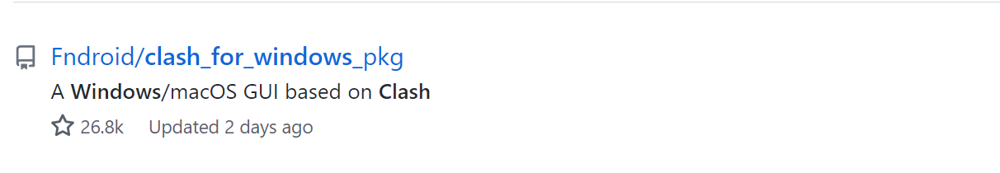

2. 点击右侧的发行版。

   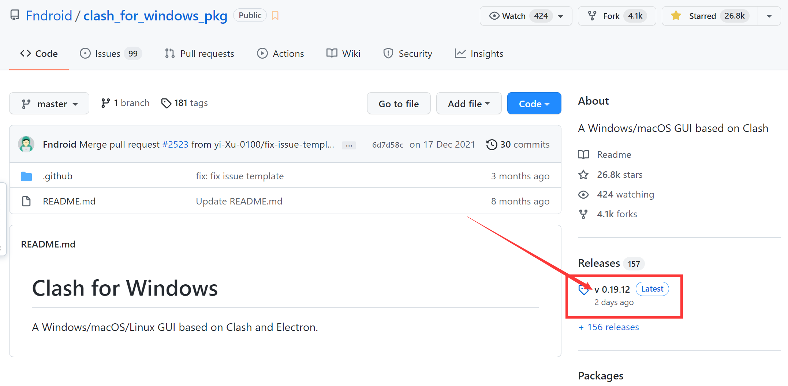

3. 找到对应的版本(右键复制链接)，下载。

   **Windows下载（需要上传到ubuntu下）**

   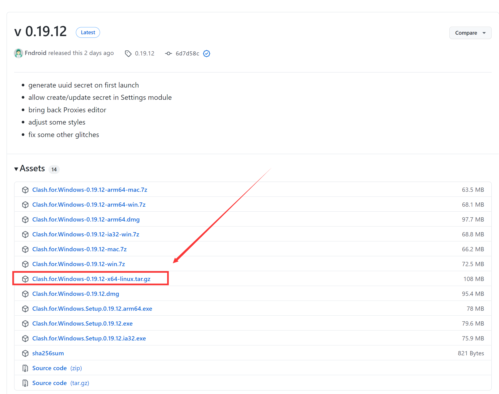

   **Ubuntu下下载（如果没有wget可以执行`sudo apt-get install wget`安装）**

   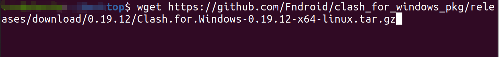

4. 创建一个专门安装软件的文件夹（我喜欢的方式，比喜欢可以不用）

   ```shell
   # $或者#后面的才是命令
   ubuntu@ubuntu:~$mkdir ~/.app
   ubuntu@ubuntu:~$tar -zxvf Clash.for.Windows-0.19.12-x64-linux.tar.gz -C ~/.app
   ubuntu@ubuntu:~$cd ~/.app
   ubuntu@ubuntu:~/.app$mv Clash\ for\ Windows-0.19.12-x64-linux/ clash
   ubuntu@ubuntu:~/.app$cd clash
   ```

5. 创建快捷桌面。

   ```shell
   ubuntu@ubuntu:~/.app/clash$wget https://cdn.jsdelivr.net/gh/Dreamacro/clash@master/docs/logo.png	# 下载clash icon做为桌面图标
   ubuntu@ubuntu:~/.app/clash$vim clash.desktop
   # 输入下面的内容
   [Desktop Entry]
    Name=clash
    Comment=Clash
    Exec=/home/你的用户名/.app/clash/cfw
    Icon=/home/你的用户名/.app/clash/logo.png
    Type=Application
    Categories=Development;
    StartupNotify=true
    NoDisplay=false
    
    ubuntu@ubuntu:~/.app/clash$ sudo mv clash.desktop /usr/share/applications/
   ```

6. 打开更多应用。

   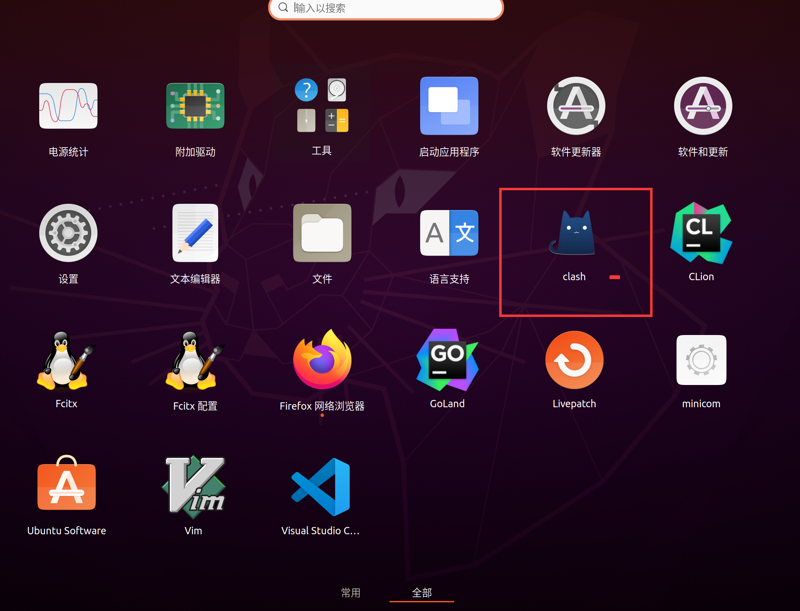

7. 双击打开clash，点击profiles导入节点。

   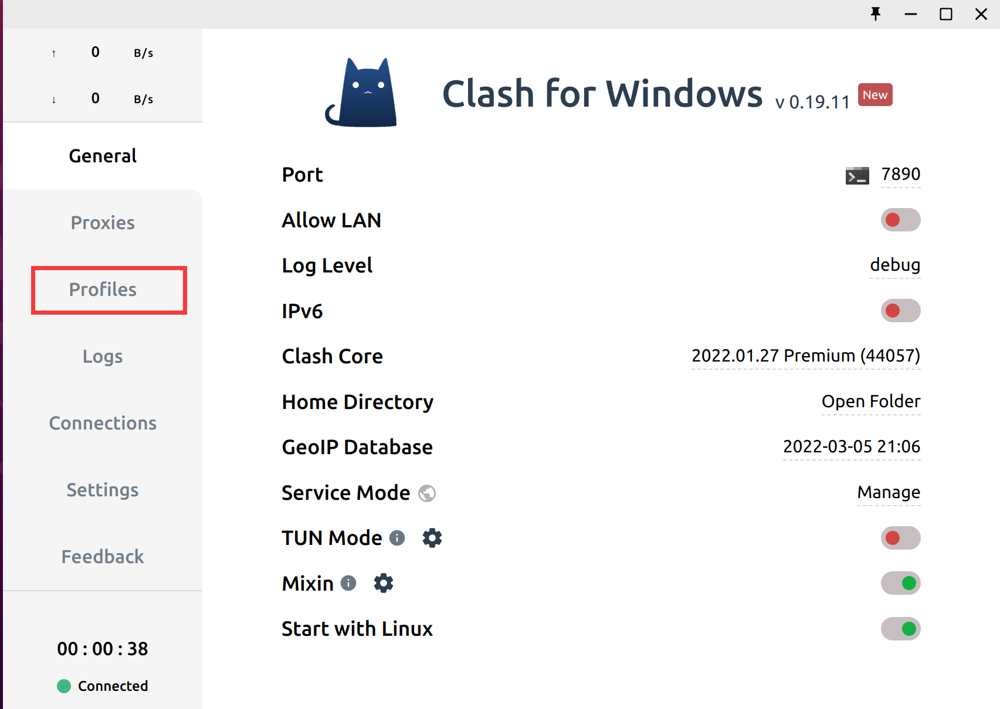

8. 复制你购买到的订阅地址输入到输入框里，点击Download下载节点。

   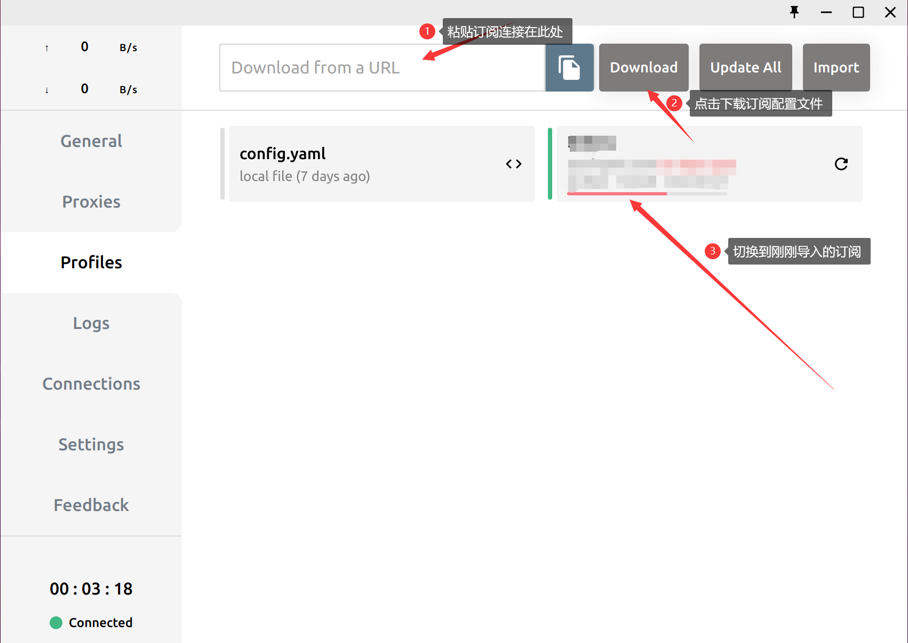

9. 点击General，打开Mixin。

   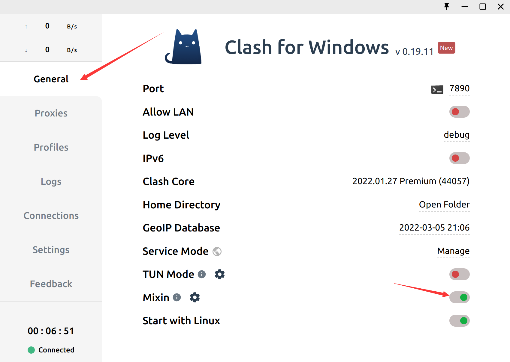

10. 打开设置，找到网络接着找网络代理。

    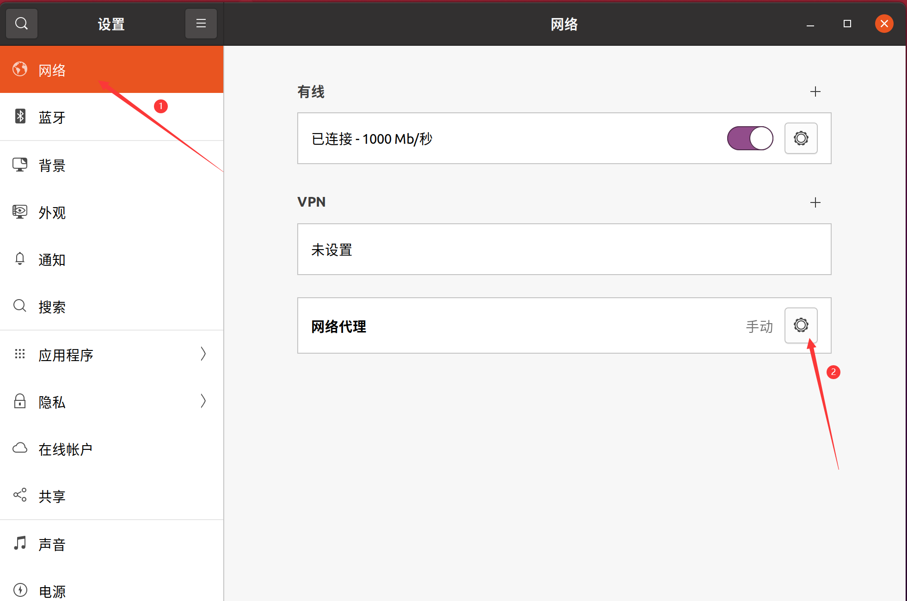

11. 设置网络代理。

    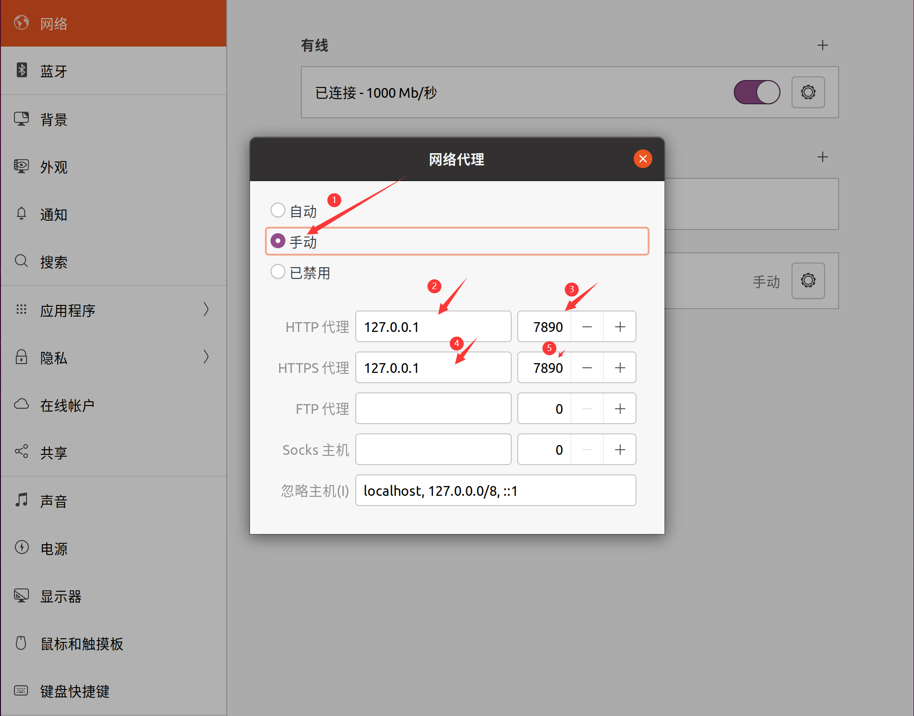

12. 大功告成！enjoy！

    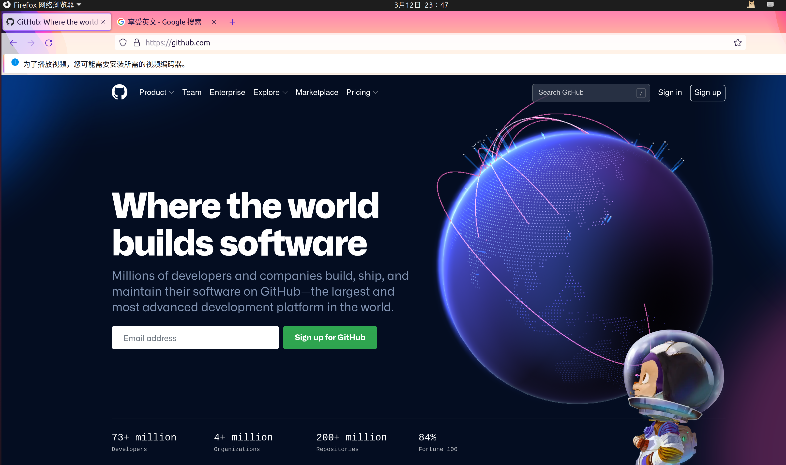


