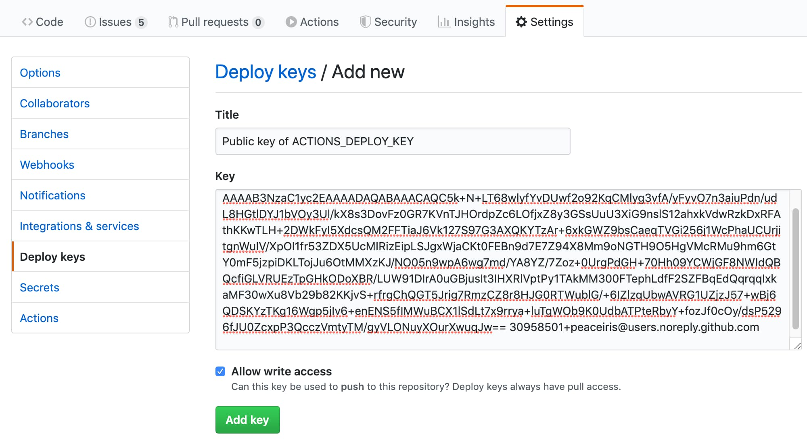
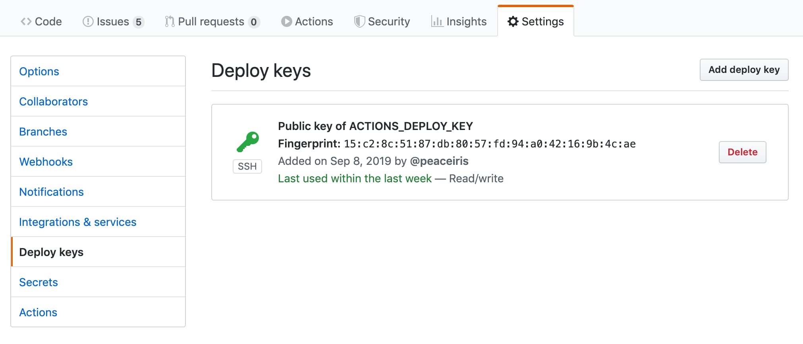
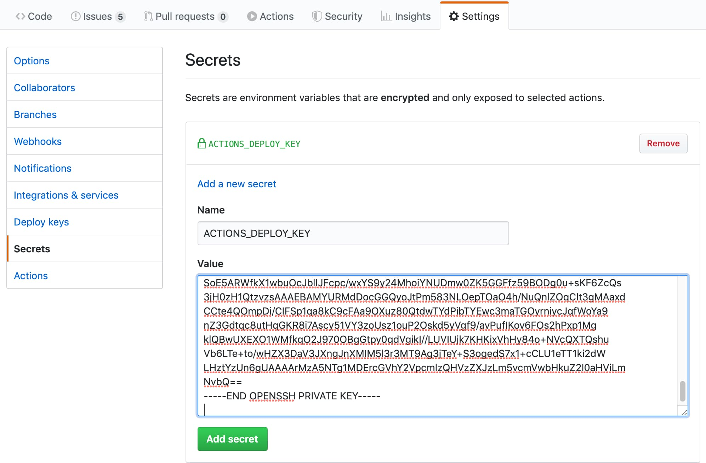
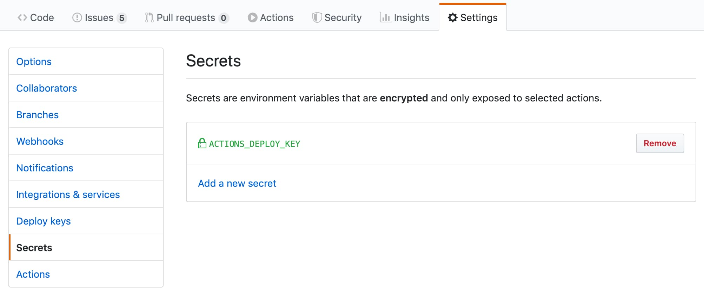

# Hugo系列教程(Hugo tutorial)


# Hugo系列教程(Hugo tutorial)

#### hugo介绍（introduce）

> A Fast and Flexible Static Site Generator built with love by [bep](https://github.com/bep), [spf13](http://spf13.com/) and [friends](https://github.com/gohugoio/hugo/graphs/contributors) in [Go](https://golang.org/).

一个快速灵活的静态站点生成器,由 [bep](https://github.com/bep), [spf13](http://spf13.com/) and [friends](https://github.com/gohugoio/hugo/graphs/contributors)用go语言编写的。

#### 安装hugo（install hugo or hugo_extended）

安装Hugo有许多种方式，这里以通过安装包安装Hugo为例！

**通过安装包（Installation package ）**(推荐)

​	从[Release](https://github.com/gohugoio/hugo/releases)下载对应系统的安装包来安装

​	**ubuntu:**

```shell
wget https://github.com/gohugoio/hugo/releases/download/v0.92.0/hugo_0.92.0_Linux-64bit.deb
wget https://github.com/gohugoio/hugo/releases/download/v0.92.0/hugo_extended_0.92.0_Linux-64bit.deb
sudo dpkg -i hugo_0.92.0_Linux-64bit.deb
sudo dpkg -i hugo_extended_0.92.0_Linux-64bit.deb
```

**windows**:

下载[.zip](https://github.com/gohugoio/hugo/releases/download/v0.92.0/hugo_0.92.0_Windows-64bit.zip)解压到你想把hugo安装的路径下，把hugo安装路径添加到`系统PATH变量`即可

#### 创建第一个hugo网站(Create your first website with Hugo)

你只需要运行下面几行代码就可以快速生成一个静态网站。

**step1：**

```shell
hugo new site mywebsite
```

命令解释：

​	hugo：hugo的根命令

​	new site：创建网站的命令

​	mywebsite：网站的名字

**step2:**

**为你的网站添加一个主题（这是必要的,这里以[LoveIt](https://github.com/dillonzq/LoveIt)主题为例，也是我本人在用的一个主题[myblog](https://hiifong.github.io)）**

你可以从hugo主题网站上挑选一个你喜欢的主题来用

```shell
cd mywebsite
git init
git submodule add https://github.com/dillonzq/LoveIt.git themes/LoveIt
```

修改网站主题基本配置

修改`config.toml`为下面的内容,可对照注释修改相应的配置以适合你的网站

```toml
baseURL = "http://example.org/"
# [en, zh-cn, fr, ...] 设置默认的语言
defaultContentLanguage = "zh-cn"
# 网站语言, 仅在这里 CN 大写
languageCode = "zh-CN"
# 是否包括中日韩文字
hasCJKLanguage = true
# 网站标题
title = "我的全新 Hugo 网站"

# 更改使用 Hugo 构建网站时使用的默认主题
theme = "LoveIt"

[params]
  # LoveIt 主题版本
  version = "0.2.X"

[menu]
  [[menu.main]]
    identifier = "posts"
    # 你可以在名称 (允许 HTML 格式) 之前添加其他信息, 例如图标
    pre = ""
    # 你可以在名称 (允许 HTML 格式) 之后添加其他信息, 例如图标
    post = ""
    name = "文章"
    url = "/posts/"
    # 当你将鼠标悬停在此菜单链接上时, 将显示的标题
    title = ""
    weight = 1
  [[menu.main]]
    identifier = "tags"
    pre = ""
    post = ""
    name = "标签"
    url = "/tags/"
    title = ""
    weight = 2
  [[menu.main]]
    identifier = "categories"
    pre = ""
    post = ""
    name = "分类"
    url = "/categories/"
    title = ""
    weight = 3
```

#### 创建你的第一篇文章

```shell
hugo new posts/first_post.md
```

> 注意
>
> 默认情况下, 所有文章和页面均作为草稿创建. 如果想要渲染这些页面, 请从元数据中删除属性 `draft: true`, 设置属性 `draft: false` 或者为 `hugo` 命令添加 `-D`/`--buildDrafts` 参数.

#### 在本地启动网站

```shell
hugo serve 		
# 可以通过访问本地机器的ip:1313来访问网站，1313位默认端口，如果该端口被其他出现占用，则会随机使用一个未被占用的端口来提供服务，集体可以查看终端输出的日志
```

> 技巧
>
> 当你运行 `hugo serve` 时, 当文件内容更改时, 页面会随着更改自动刷新.

> 注意
>
> 由于本主题使用了 Hugo 中的 `.Scratch` 来实现一些特性, 非常建议你为 `hugo server` 命令添加 `--disableFastRender` 参数来实时预览你正在编辑的文章页面.

####  构建网站

```shell
hugo
```

至此，你已经学会了hugo的基本操作。

更多关于hugo的操作，你可以访问[hugo官网](https://gohugo.io/)以及你所使用的主题文档自行查看。

#### 将你的hugo网站部署到GitHub Page

> 当你构建网站是会在网站根目录下生成一个public目录，将这个目录下的文件添加到你的GitHub 仓库的gh-page分支即可。


#### 创建一个workflow

在网站根目录下创建一个`.github/workflows/hugo.yml`

把我的[myactions仓库](https://github.com/hiifong/myactions)下的`hugo.yml`内容复制粘贴到你的`hugo.yml`,根据注释进行修改即可。

#### 在GitHub上创建一个存放网站源代码的私有仓库

```shell
git remote add origin 你的仓库地址 # 在本地仓库添加远程仓库
```

#### 在GitHub上创建一个`你的GitHub账号用户名.github.io`并设为公开仓库

#### 创建ssh部署秘钥

Generate your deploy key with the following command.

用下面的命令生成ssh秘钥。

```shell
ssh-keygen -t rsa -b 4096 -C "$(git config user.email)" -f gh-pages -N ""
# You will get 2 files:
#   gh-pages.pub (public key，公钥)
#   gh-pages     (private key，私钥)
```

Next, Go to **Repository Settings**

- Go to **Deploy Keys** and add your public key with the **Allow write access**
- Go to **Secrets** and add your private key as `ACTIONS_DEPLOY_KEY`

Add your public key


Success


Add your private key


Success


#### 推送源码到源码仓库（push）

在本地hugo网站根路径执行下面的代码

```shell
git add .
git commit -m "输入你的提交信息"
git push origin master
```

稍等片刻，通过访问`https://你的GitHub账号用户名.github.io`即可访问到你的网站。

# 大功告成！

以后更新文章只用在本地写好文章之后执行一下命令即可自动更新博客！

```shell
git add .
git commit -m "输入你的提交信息"
git push origin master
```


# Thanks

[gohugoio/hugo](https://github.com/gohugoio/hugo)

[peaceiris/actions-gh-pages](https://github.com/peaceiris/actions-gh-pages)

[dillonzq/LoveIt](https://github.com/dillonzq/LoveIt)

